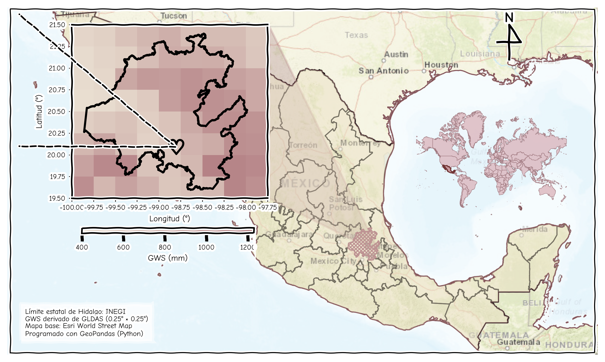

  <strong>English</strong> | <a href="README_ES.md">Español</a>

# Aura Ramos Lora, PhD

**Data Integration and Transformation for Spatial Analysis**

### Geospatial Information Science · Spatial Analysis · GIS · Data Science · Artificial Intelligence

I hold a PhD in Geospatial Information Science and specialize in the integration,
transformation, and spatial analysis of heterogeneous data.

My work spans the complete geospatial data workflow: from data extraction, cleaning,
standardization, and integration to spatial and temporal analysis, visualization,
modeling, and the preparation of structured datasets for computational and
artificial intelligence applications.

I work with multiple types of information — from tabular and vector data to raster,
satellite imagery, time series, and multidimensional scientific datasets — transforming
them into consistent geospatial information that can be analyzed, modeled, and
interpreted spatially.

My experience combines **GIS, scientific programming, spatial data science,
remote sensing, and machine learning**, with applications in geology,
environmental analysis, groundwater, and territorial studies.

I also develop computational tools and geospatial workflows, particularly in
**Python and QGIS/PyQGIS**, to automate spatial analysis and solve specialized
geospatial problems.

---

## Featured Projects

### 🗺️ SecGeol
QGIS plugin for the construction and analysis of 2D and 3D geological
cross-sections from DEMs and vector geological information.

**Python · PyQGIS · QGIS · Qt**

### 🌎 Geospatial Analysis & Data Integration
Development of workflows for cleaning, transforming, integrating, and analyzing
heterogeneous spatial and temporal datasets.

**GeoPandas · Rasterio · Xarray · Shapely · GDAL · NetCDF**

### 🤖 Spatial Data Science & Artificial Intelligence
Application of machine learning and deep learning architectures to geospatial
and environmental datasets, including multidimensional satellite and climate data.

**Scikit-learn · TensorFlow · MLP · CNN · LSTM · CRNN**

---

## Professional Profile

📄 **[Curriculum Vitae — PDF](CV_Aura_Ramos_Lora.pdf)**

🏅 **[Certificates & Professional Recognition](https://aurarlora.github.io/web_certificados/)**

---

## Tools & Technologies

`Python` · `QGIS` · `PyQGIS` · `GeoPandas` · `Pandas` · `NumPy` ·
`Rasterio` · `Xarray` · `Shapely` · `GDAL` · `Scikit-learn` ·
`TensorFlow` · `Git` · `GitHub`
