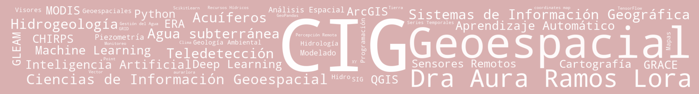

  <strong>English</strong> | <a href="README_ES.md">Español</a>

# Dr. Aura Ramos Lora

**Data Integration and Transformation for Spatial Analysis**

### Geospatial Information Science · Spatial Analysis · GIS · Data Science · Artificial Intelligence

PhD in Geospatial Information Science, specializing in the analysis,
integration, and transformation of geospatial and temporal data. My work
ranges from data cleaning and standardization to transforming large volumes
of heterogeneous information into coherent datasets suitable for spatial
analysis and for use in artificial intelligence models and architectures.

I work with data from diverse sources and formats—from tabular and vector
data to raster datasets, time series, and satellite products—integrating
them through Geographic Information Systems and computational tools for
spatial analysis, visualization, and modeling.

I have applied these methodologies primarily to geology, hydrogeology,
environmental geology, water resources, and territorial analysis,
incorporating machine learning and deep learning techniques when required
by the problem.
