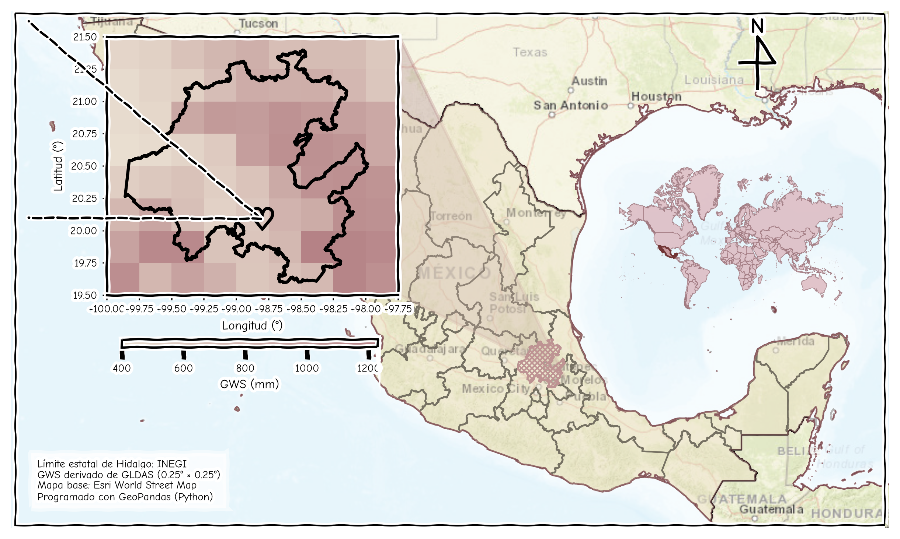

  <strong>English</strong> | <a href="README_ES.md">Español</a>

# Aura Ramos Lora, PhD

**Data Integration and Transformation for Spatial Analysis**

### Geospatial Information Sciences · Spatial Analysis · GIS · Data Science · Artificial Intelligence

I hold a PhD in Geospatial Information Sciences, with experience in data integration and analysis, process automation, and the development of computational tools for geosciences. I transform heterogeneous information into structured, reproducible datasets for spatial analysis, modeling, and use in artificial intelligence systems.

I work with tabular, vector, and raster data, time series, and satellite products. I integrate these sources through Geographic Information Systems and programming, from data cleaning and standardization to analysis, visualization, and the generation of technical and scientific outputs.

I develop solutions to automate field data collection and validation, facilitate analytical processes, and build reusable geospatial tools. My developments include SecGeol, a free and open-source plugin published in the official QGIS plugin repository to support the construction of geological cross-sections.

My experience encompasses applications in geology, hydrogeology, environmental geology, water resources, and territorial analysis. I incorporate machine learning and deep learning techniques when appropriate to the problem, with attention to data quality, validation of results, and the usefulness of the solutions.

---

## Featured Projects

### 🗺️ [SecGeol](https://github.com/aurarlora/secgeol)

QGIS plugin for the construction and analysis of 2D and 3D geological cross-sections from DEMs and vector geological information.

🧩 [QGIS Plugin Repository](https://plugins.qgis.org/plugins/secgeol/)

📖 [User Manual](https://aurarlora.github.io/secgeol/)

### 🌎 Geospatial Analysis & Data Integration
Development of workflows for cleaning, transforming, integrating, and analyzing
heterogeneous spatial and temporal datasets.

**GeoPandas · Rasterio · Xarray · Shapely · GDAL · NetCDF**

### 🤖 Spatial Data Science & Artificial Intelligence
Application of machine learning and deep learning architectures to geospatial
and environmental datasets, including multidimensional satellite and climate data.

**Scikit-learn · TensorFlow · MLP · CNN · LSTM · CRNN**

---

## Professional Profile

🏅 **[Certificates & Professional Recognition](https://aurarlora.github.io/web_certificados/)**

---

## Tools & Technologies

`Python` · `QGIS` · `PyQGIS` · `GeoPandas` · `Pandas` · `NumPy` · `QField` ·`QFieldCloud` ·
`Rasterio` · `Xarray` · `Shapely` · `GDAL` · `Scikit-learn` ·`ArcGis`· `Arcpy`·
`TensorFlow` · `Git` · `GitHub`. `Rasterio` · `NetCDF` 
