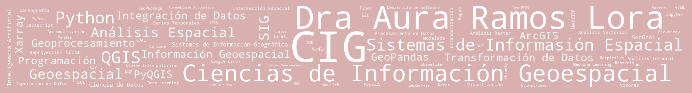

  <a href="README.md">English</a> | <strong>Español</strong>

# Dra. Aura Ramos Lora

**Transformación e integración de datos, modelado geoespacial y desarrollo de herramientas para el análisis espacial**

### Ciencias de Información Geoespacial · Análisis Espacial · SIG · Ciencia de Datos · Inteligencia Artificial

Doctora en Ciencias de Información Geoespacial, con experiencia en integración y análisis de datos, automatización de procesos y desarrollo de herramientas computacionales para geociencias. Transformo información heterogénea en conjuntos de datos estructurados y reproducibles para el análisis espacial, el modelado y su uso en sistemas de inteligencia artificial.

Trabajo con datos tabulares, vectoriales y ráster, series temporales y productos satelitales. Integro estas fuentes mediante Sistemas de Información Geográfica y programación, desde la depuración y estandarización hasta el análisis, la visualización y la generación de productos técnicos y científicos.

Desarrollo soluciones para automatizar la captura y validación de información de campo, facilitar procesos de análisis y construir herramientas geoespaciales reutilizables. Entre mis desarrollos se encuentra SecGeol, un complemento de software libre publicado en el repositorio oficial de QGIS para apoyar la construcción de secciones geológicas.

Mi experiencia comprende aplicaciones en geología, hidrogeología, geología ambiental, recursos hídricos y análisis territorial. Incorporo técnicas de aprendizaje automático y aprendizaje profundo cuando son pertinentes para el problema, con atención a la calidad de los datos, la validación de resultados y la utilidad de las soluciones.

---

## Perfil profesional

🏅 **[Certificados y reconocimientos profesionales](https://aurarlora.github.io/web_certificados/)**

### **ORCID:** [0009-0008-8093-8440](https://orcid.org/0009-0008-8093-8440)

---

## Áreas de trabajo

🛰️ **Teledetección y análisis geoespacial**  
💧 **Hidrogeología y recursos hídricos**  
🤖 **Inteligencia artificial y aprendizaje automático**  
🗺️ **Sistemas de Información Geográfica**  
💻 **Desarrollo de herramientas geoespaciales**

---

## Investigación y desarrollo

### 🗺️ [SecGeol](https://github.com/aurarlora/secgeol)

Plugin para QGIS orientado a la construcción y análisis de secciones
geológicas en 2D y 3D.

🧩 [Plugin en la página oficial de QGIS](https://plugins.qgis.org/plugins/secgeol/)

📖 [Manual de usuario](https://aurarlora.github.io/secgeol/es/)

### 💧 Groundwater Storage & Artificial Intelligence
Investigación orientada al análisis de la variabilidad del almacenamiento
de agua subterránea mediante información satelital, variables climáticas
y arquitecturas de aprendizaje profundo.

**Remote Sensing · Deep Learning · Hydrogeology · Python**

### 🌎 Análisis geoespacial
Desarrollo de metodologías y herramientas para el procesamiento,
integración y análisis de información espacial.

### 🛰️🐍💻 Automatización y Desarrollo 
Desarrollo de herramientas para la captura de información en campo y el procesamiento de datos, así como de interfaces para su consulta y descarga.

---

## Tecnologías

`Python` · `QGIS` · `PyQGIS` · `GeoPandas` · `Rasterio` · `Xarray` ·  `ArcGis` ·   `Arcpy` 
`TensorFlow` · `Scikit-learn` · `Git` · `LaTeX` · `Qt`· `QField`· `QFieldCloud ` 

---
